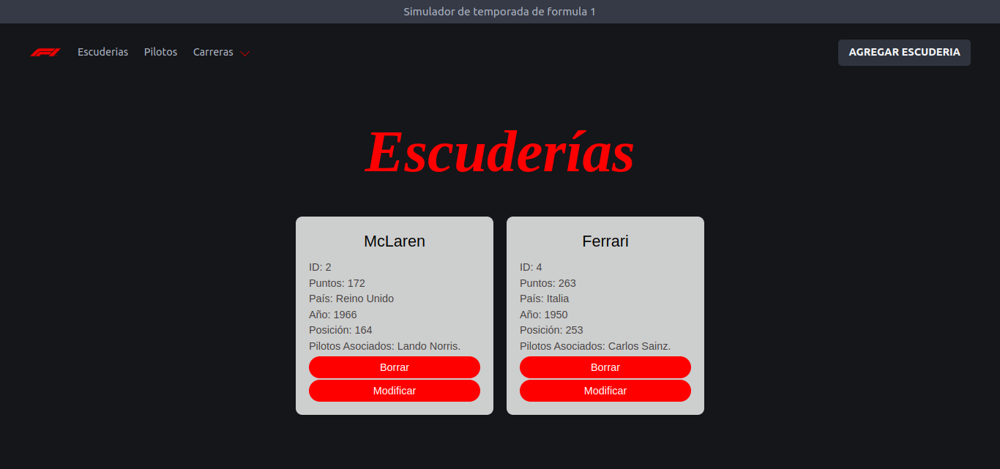
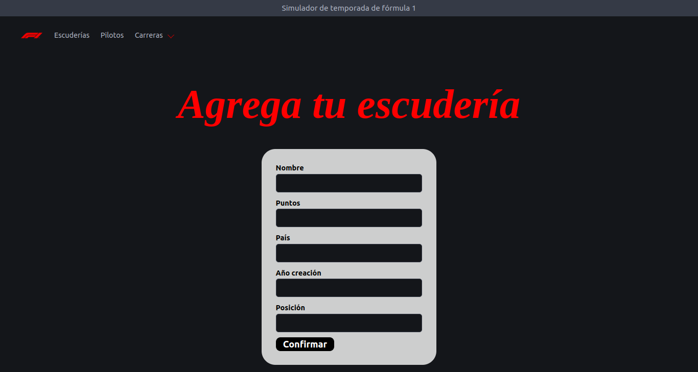
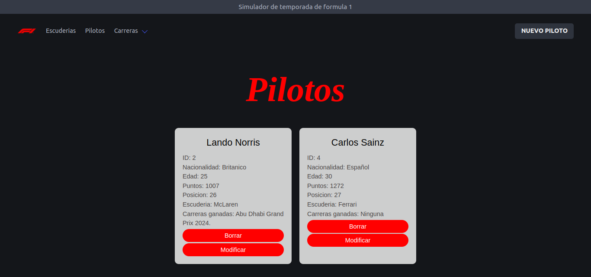
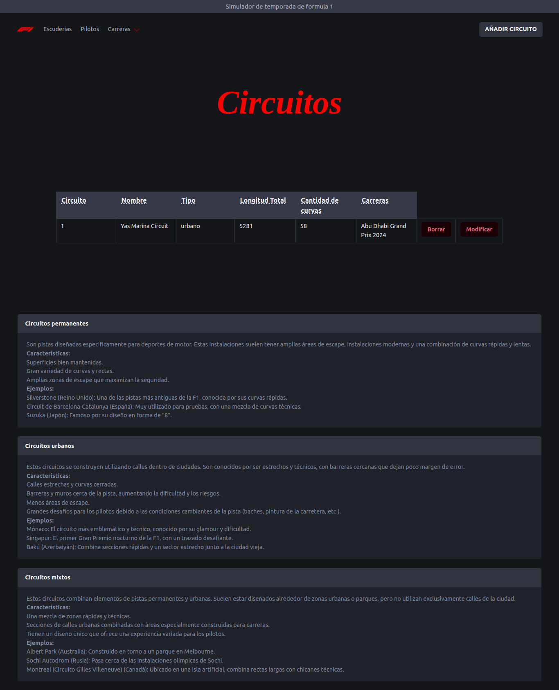
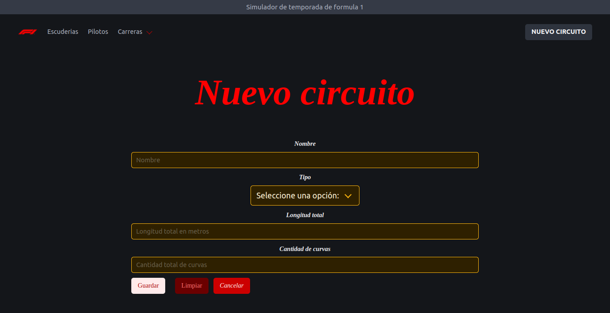
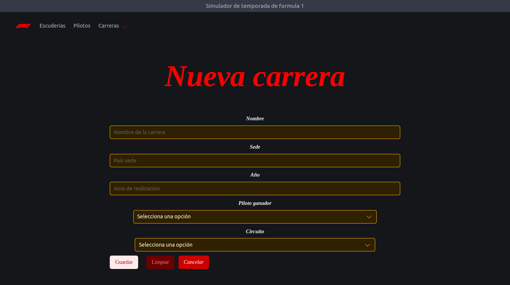

# Simulador de Temporada de Fórmula 1

Este proyecto es una API REST con un CRUD accesible desde el frontend para cada entidad: escuderías, pilotos, carreras y circuitos. Permite crear, modificar, borrar y ver cada una de las entidades, simulando una temporada de Fórmula 1.

## Requisitos

- Docker
- Node.js

## Instalación y Ejecución

1. Instalar las dependencias:
    ```sh
    npm install
    ```

2. Ejecutar las migraciones:
    ```sh
    npx prisma migrate dev
    ```

### Levantar los servicios de Docker

```sh
docker-compose up -d
```

### Levantar el servidor

```sh
npm run dev
```
### Frontend

Para abrir el frontend, simplemente abre el archivo pagina-principal.html en tu navegador.

## Capturas de Pantalla














